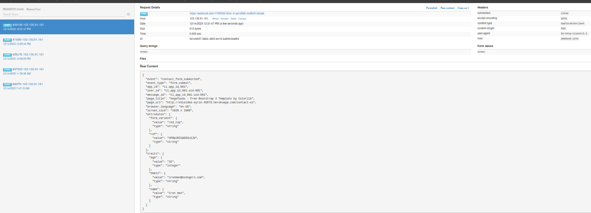

# Goroutine-Request

### To run the Appliction
```bash
go run main.go
```
### API TESTING 

#### Sample Input 1:
```bash
{
"ev": "contact_form_submitted",
"et": "form_submit",
"id": "cl_app_id_001",
"uid": "cl_app_id_001-uid-001",
"mid": "cl_app_id_001-uid-001",
"t": "Vegefoods - Free Bootstrap 4 Template by Colorlib",
"p": "http://shielded-eyrie-45679.herokuapp.com/contact-us",
"l": "en-US",
"sc": "1920 x 1080",
"atrk1": "form_varient",
"atrv1": "red_top",
"atrt1": "string",
"atrk2": "ref",
"atrv2": "XPOWJRICW993LKJD",
"atrt2": "string",
"uatrk1": "name",
"uatrv1": "iron man",
"uatrt1": "string",
"uatrk2": "email",
"uatrv2": "ironman@avengers.com",
"uatrt2": "string",
"uatrk3": "age",
"uatrv3": "32",
"uatrt3": "integer",
}
```
#### Sample Output 1:
```bash
{
"event": "contact_form_submitted",
"event_type": "form_submit",
"app_id": "cl_app_id_001",
"user_id": "cl_app_id_001-uid-001",
"message_id": "cl_app_id_001-uid-001","page_title": "Vegefoods - Free Bootstrap 4 Template by Colorlib",
"page_url": "http://shielded-eyrie-45679.herokuapp.com/contact-us",
"browser_language": "en-US",
"screen_size": "1920 x 1080",
"attributes": { "form_varient": {
"value": "red_top",
"type": "string" },
"ref": {
"value": "XPOWJRICW993LKJD",
"type": "string"} },
"traits": {
"name": {
"value": "iron man",
"type": "string"},
"email": {
"value": "ironman@avengers.com",
"type": "string"},
"age": {
"value": "32",
"type": "integer"}}
}
```

#### Webhook Response



#### Sample Input 1:
```bash
{
"ev": "contact_form_submitted",
"et": "form_submit",
"id": "cl_app_id_001",
"uid": "cl_app_id_001-uid-001",
"mid": "cl_app_id_001-uid-001",
"t": "Vegefoods - Free Bootstrap 4 Template by Colorlib",
"p": "http://shielded-eyrie-45679.herokuapp.com/contact-us",
"l": "en-US",
"sc": "1920 x 1080",
"atrk1": "form_varient",
"atrv1": "red_top",
"atrt1": "string",
"atrk2": "ref",
"atrv2": "XPOWJRICW993LKJD",
"atrt2": "string",
"uatrk1": "name",
"uatrv1": "iron man",
"uatrt1": "string",
"uatrk2": "email",
"uatrv2": "ironman@avengers.com",
"uatrt2": "string",
"uatrk3": "age",
"uatrv3": "32",
"uatrt3": "integer",
}
```
#### Sample Output 1:
```bash
{
"event": "contact_form_submitted",
"event_type": "form_submit",
"app_id": "cl_app_id_001",
"user_id": "cl_app_id_001-uid-001",
"message_id": "cl_app_id_001-uid-001","page_title": "Vegefoods - Free Bootstrap 4 Template by Colorlib",
"page_url": "http://shielded-eyrie-45679.herokuapp.com/contact-us",
"browser_language": "en-US",
"screen_size": "1920 x 1080",
"attributes": { "form_varient": {
"value": "red_top",
"type": "string" },
"ref": {
"value": "XPOWJRICW993LKJD",
"type": "string"} },
"traits": {
"name": {
"value": "iron man",
"type": "string"},
"email": {
"value": "ironman@avengers.com",
"type": "string"},
"age": {
"value": "32",
"type": "integer"}}
}
```

#### Webhook Response


#### Sample Input 1:
```bash
{
"ev": "contact_form_submitted",
"et": "form_submit",
"id": "cl_app_id_001",
"uid": "cl_app_id_001-uid-001",
"mid": "cl_app_id_001-uid-001",
"t": "Vegefoods - Free Bootstrap 4 Template by Colorlib",
"p": "http://shielded-eyrie-45679.herokuapp.com/contact-us",
"l": "en-US",
"sc": "1920 x 1080",
"atrk1": "form_varient",
"atrv1": "red_top",
"atrt1": "string",
"atrk2": "ref",
"atrv2": "XPOWJRICW993LKJD",
"atrt2": "string",
"uatrk1": "name",
"uatrv1": "iron man",
"uatrt1": "string",
"uatrk2": "email",
"uatrv2": "ironman@avengers.com",
"uatrt2": "string",
"uatrk3": "age",
"uatrv3": "32",
"uatrt3": "integer",
}
```
#### Sample Output 1:
```bash
{
"event": "contact_form_submitted",
"event_type": "form_submit",
"app_id": "cl_app_id_001",
"user_id": "cl_app_id_001-uid-001",
"message_id": "cl_app_id_001-uid-001","page_title": "Vegefoods - Free Bootstrap 4 Template by Colorlib",
"page_url": "http://shielded-eyrie-45679.herokuapp.com/contact-us",
"browser_language": "en-US",
"screen_size": "1920 x 1080",
"attributes": { "form_varient": {
"value": "red_top",
"type": "string" },
"ref": {
"value": "XPOWJRICW993LKJD",
"type": "string"} },
"traits": {
"name": {
"value": "iron man",
"type": "string"},
"email": {
"value": "ironman@avengers.com",
"type": "string"},
"age": {
"value": "32",
"type": "integer"}}
}
```

#### Webhook Response
